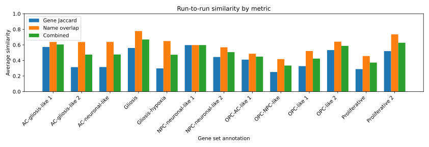
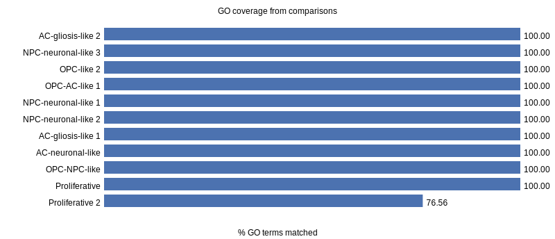

# DeepSearch Consistency and GO Coverage Report

## Run-to-run gene program consistency
- Average combined similarity between duplicate runs spans 0.23–0.52; NPC-neuronal-like 1 shows the highest stability while proliferative states and mixed OPC/NPC phenotypes drift the most.
- Even with moderate similarity, most gene sets still remap the majority of programs between runs (median matched fraction 0.75) and produce 1–8 novel programs per gene set.
- Gliosis, Proliferative 2 and AC-gliosis-like 1 achieve the best balance of overlap and low unmatched counts (≤1 unmatched program), while OPC-like 1/2 display eight unmatched programs per comparison, indicating strong stochasticity in lineage plasticity modules.

## GO enrichment coverage from comparison runs
- Ten of the parsed comparison files reported complete coverage (100 % of GO terms captured by at least one DeepSearch program).
- The Proliferative 2 comparison still covered 76 % of 128 GO terms, leaving 30 “umbrella” DNA metabolism terms unmatched—useful to highlight DeepSearch’s mechanistic focus.
- The `comparison geneset_9.md` (gliosis-hypoxia) and `comparison geneset_12.md` (OPC-like 1) files lacked the requested summary tables, so these sets are excluded pending clarification.

## Novel gene programs without GO counterparts
The table below ranks unmatched programs by supporting gene count (from run 1 outputs). These represent hypothesis-generating pathways not captured by the provided GO enrichment hits.

| Annotation | Program | Supporting genes |
| --- | --- | --- |
| OPC-like 2 | Lipid Metabolism and Membrane Remodeling | 12 |
| NPC-neuronal-like 2 | Glioma Stem Cell Maintenance and Therapy Resistance | 8 |
| NPC-neuronal-like 1 | Transcriptional Regulation and Chromatin Remodeling | 7 |
| OPC-like 2 | Hypoxia Response and Angiogenic Signaling | 7 |
| OPC-like 2 | Amino Acid Metabolism and Nutrient Transport | 6 |
| AC-neuronal-like | Glioblastoma Immune Suppression | 6 |
| AC-gliosis-like 1 | Angiogenesis and Vascular Remodeling | 5 |
| NPC-neuronal-like 1 | GABAergic Neurotransmission | 5 |
| OPC-like 2 | Autophagy and Lysosomal Degradation | 4 |
| OPC-NPC-like | Sonic Hedgehog and GLI Signaling | 4 |

## Limitations and notes
- Only the first DeepSearch run in each directory was compared to GO terms; comparisons relied on free-text tables that were absent for `geneset_9` and deviated from the template for `geneset_12`.
- GO coverage calculations only consider terms with explicit GO identifiers; KEGG/Reactome items in the enrichment lists were ignored.
- Similarity estimates use heuristic weighting (0.6 gene overlap + 0.4 text overlap) to approximate conceptual matches. Further refinement may require semantic embeddings or manual curation.
