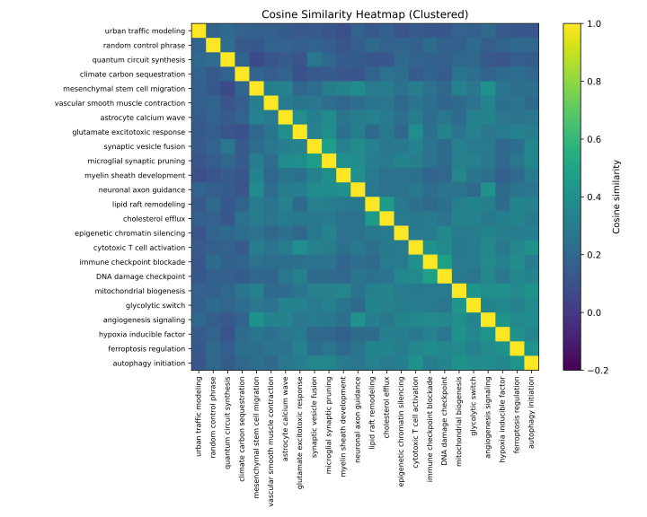

# Embedding Similarity Calibration

## Phrase list
- angiogenesis signaling
- synaptic vesicle fusion
- lipid raft remodeling
- immune checkpoint blockade
- astrocyte calcium wave
- myelin sheath development
- ferroptosis regulation
- autophagy initiation
- epigenetic chromatin silencing
- neuronal axon guidance
- cytotoxic T cell activation
- mesenchymal stem cell migration
- DNA damage checkpoint
- glutamate excitotoxic response
- hypoxia inducible factor
- cholesterol efflux
- vascular smooth muscle contraction
- microglial synaptic pruning
- mitochondrial biogenesis
- glycolytic switch
- random control phrase
- urban traffic modeling
- quantum circuit synthesis
- climate carbon sequestration

## Statistics
- Pairwise cosine count: 276
- Mean: 0.259
- Median: 0.262
- Std: 0.082
- Min: 0.071
- Max: 0.481

## Histogram (bins: [-1,1] split into 10)
- [-1.00, -0.80]: 0
- [-0.80, -0.60]: 0
- [-0.60, -0.40]: 0
- [-0.40, -0.20]: 0
- [-0.20, +0.00]: 0
- [+0.00, +0.20]: 76
- [+0.20, +0.40]: 186
- [+0.40, +0.60]: 14
- [+0.60, +0.80]: 0
- [+0.80, +1.00]: 0

## Top Similar Phrase Pairs
| Rank | Phrase A | Phrase B | Cosine |
| --- | --- | --- | --- |
| 1 | immune checkpoint blockade | DNA damage checkpoint | 0.481 |
| 2 | synaptic vesicle fusion | microglial synaptic pruning | 0.470 |
| 3 | lipid raft remodeling | cholesterol efflux | 0.454 |
| 4 | mitochondrial biogenesis | glycolytic switch | 0.429 |
| 5 | angiogenesis signaling | hypoxia inducible factor | 0.420 |
| 6 | ferroptosis regulation | autophagy initiation | 0.419 |
| 7 | angiogenesis signaling | mesenchymal stem cell migration | 0.419 |
| 8 | autophagy initiation | mitochondrial biogenesis | 0.416 |
| 9 | ferroptosis regulation | hypoxia inducible factor | 0.411 |
| 10 | autophagy initiation | cytotoxic T cell activation | 0.410 |

## Pairs Around Mean Cosine (value = 0.259)
| Side | Phrase A | Phrase B | Cosine |
| --- | --- | --- | --- |
| Below mean | ferroptosis regulation | vascular smooth muscle contraction | 0.258 |
| Below mean | vascular smooth muscle contraction | glycolytic switch | 0.257 |
| Below mean | astrocyte calcium wave | ferroptosis regulation | 0.257 |
| Above mean | cytotoxic T cell activation | vascular smooth muscle contraction | 0.259 |
| Above mean | neuronal axon guidance | DNA damage checkpoint | 0.262 |
| Above mean | myelin sheath development | glycolytic switch | 0.262 |

## Pairs Around Median Cosine (value = 0.262)
| Side | Phrase A | Phrase B | Cosine |
| --- | --- | --- | --- |
| Below median | neuronal axon guidance | DNA damage checkpoint | 0.262 |
| Below median | cytotoxic T cell activation | vascular smooth muscle contraction | 0.259 |
| Below median | ferroptosis regulation | vascular smooth muscle contraction | 0.258 |
| Above median | myelin sheath development | glycolytic switch | 0.262 |
| Above median | mitochondrial biogenesis | climate carbon sequestration | 0.262 |
| Above median | ferroptosis regulation | neuronal axon guidance | 0.262 |

Confusion matrix saved to `analysis/embedding_confusion_matrix.csv`

