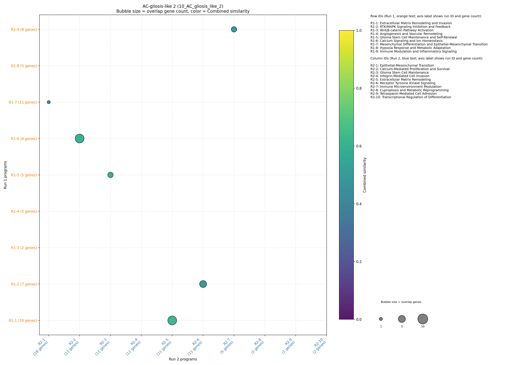
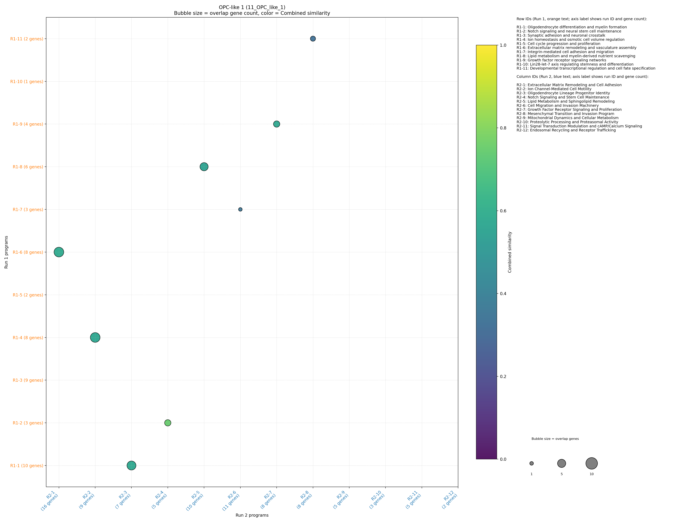
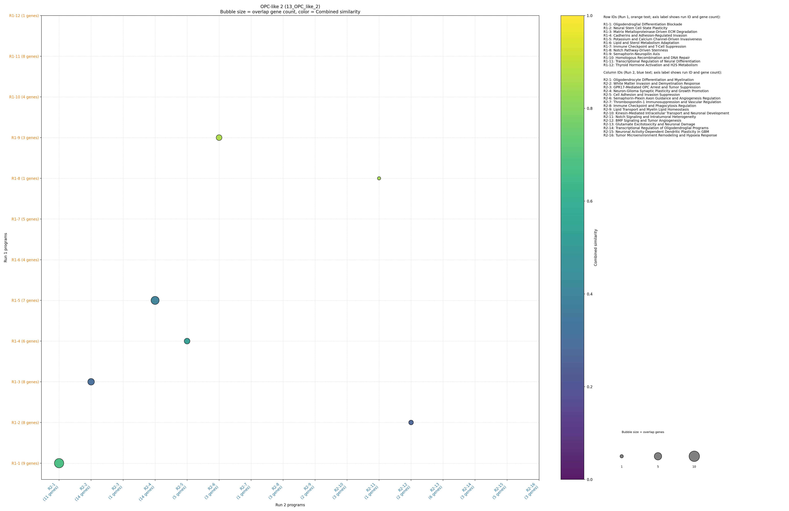

<!-- TODO: insert summary by editing reports/summary_intro.md -->

## Duplicated runs
- OPC-NPC-like (6_OPC_NPC_like): DeepSearch runs are identical; only run_1 is shown.
- Proliferative (7_Proliferative): DeepSearch runs are identical; only run_1 is shown.

## 10_AC_gliosis_like_2

| Smaller set | Matched set | Gene overlap | Gene Jaccard | Name sim | Combined |
| --- | --- | --- | --- | --- | --- |
| Extracellular Matrix Remodeling and Invasion | Extracellular Matrix Remodeling | 8 | 0.38 | 0.88 | 0.63 |
| Calcium Signaling and Ion Homeostasis | Calcium-Mediated Proliferation and Survival | 8 | 0.62 | 0.57 | 0.59 |
| Glioma Stem Cell Maintenance and Self-Renewal | Glioma Stem Cell Maintenance | 3 | 0.23 | 0.94 | 0.59 |
| Immune Modulation and Inflammatory Signaling | Immune Microenvironment Modulation | 3 | 0.30 | 0.67 | 0.48 |
| RTK/MAPK Signaling Inhibition and Feedback | Receptor Tyrosine Kinase Signaling | 5 | 0.38 | 0.57 | 0.48 |
| Mesenchymal Differentiation and Epithelial-Mesenchymal Transition | Epithelial-Mesenchymal Transition | 1 | 0.04 | 0.82 | 0.43 |
| Hypoxia Response and Metabolic Adaptation | Cuproptosis and Metabolic Reprogramming | 0 | 0.00 | 0.54 | 0.27 |
| Angiogenesis and Vascular Remodeling | Integrin-Mediated Cell Invasion | 0 | 0.00 | 0.42 | 0.21 |
| Wnt/β-catenin Pathway Activation | Transcriptional Regulation of Differentiation | 0 | 0.00 | 0.38 | 0.19 |

**Component coverage:**
- AC: (none)
- gliosis: (none)

Runs: [Run 1](10_AC_gliosis_like_2/run_1.md) | [Run 2](10_AC_gliosis_like_2/run_2.md)

## 11_OPC_like_1

| Smaller set | Matched set | Gene overlap | Gene Jaccard | Name sim | Combined |
| --- | --- | --- | --- | --- | --- |
| Notch signaling and neural stem cell maintenance | Notch Signaling and Stem Cell Maintenance | 3 | 0.60 | 0.89 | 0.75 |
| Extracellular matrix remodeling and vasculature assembly | Extracellular Matrix Remodeling and Cell Adhesion | 7 | 0.41 | 0.76 | 0.58 |
| Oligodendrocyte differentiation and myelin formation | Oligodendrocyte Lineage Progenitor Identity | 6 | 0.55 | 0.61 | 0.58 |
| Growth factor receptor signaling networks | Growth Factor Receptor Signaling and Proliferation | 3 | 0.33 | 0.82 | 0.57 |
| Ion homeostasis and osmotic cell volume regulation | Ion Channel-Mediated Cell Motility | 7 | 0.70 | 0.43 | 0.57 |
| Lipid metabolism and myelin-derived nutrient scavenging | Lipid Metabolism and Sphingolipid Remodeling | 5 | 0.45 | 0.65 | 0.55 |
| Integrin-mediated cell adhesion and migration | Cell Migration and Invasion Machinery | 1 | 0.08 | 0.63 | 0.35 |
| Developmental transcriptional regulation and cell fate specification | Mesenchymal Transition and Invasion Program | 2 | 0.25 | 0.40 | 0.33 |
| Cell cycle progression and proliferation | Mitochondrial Dynamics and Cellular Metabolism | 0 | 0.00 | 0.40 | 0.20 |
| Synaptic adhesion and neuronal crosstalk | Signal Transduction Modulation and cAMP/Calcium Signaling | 0 | 0.00 | 0.38 | 0.19 |
| Lin28-let-7 axis regulating stemness and differentiation | (no match) | - | - | - | - |

**Component coverage:**
- OPC: (none)

Runs: [Run 1](11_OPC_like_1/run_1.md) | [Run 2](11_OPC_like_1/run_2.md)

## 12_NPC_neuronal_like_3

_No program matches available._

**Component coverage:**
- NPC: (none)
- neuronal: (none)

Runs: [Run 1](12_NPC_neuronal_like_3/run_1.md)

## 13_OPC_like_2

| Smaller set | Matched set | Gene overlap | Gene Jaccard | Name sim | Combined |
| --- | --- | --- | --- | --- | --- |
| Semaphorin-Neuropilin Axis | Semaphorin-Plexin Axon Guidance and Angiogenesis Regulation | 3 | 1.00 | 0.73 | 0.87 |
| Notch Pathway-Driven Stemness | Notch Signaling and Intratumoral Heterogeneity | 1 | 1.00 | 0.70 | 0.85 |
| Oligodendroglial Differentiation Blockade | Oligodendrocyte Differentiation and Myelination | 8 | 0.67 | 0.69 | 0.68 |
| Cadherins and Adhesion-Regulated Invasion | Cell Adhesion and Invasion Suppression | 3 | 0.38 | 0.68 | 0.53 |
| Potassium and Calcium Channel-Driven Invasiveness | Neuron-Glioma Synaptic Plasticity and Growth Promotion | 6 | 0.40 | 0.39 | 0.40 |
| Immune Checkpoint and T-Cell Suppression | Immune Checkpoint and Phagocytosis Regulation | 0 | 0.00 | 0.70 | 0.35 |
| Transcriptional Regulation of Neural Differentiation | Transcriptional Regulation of Oligodendroglial Programs | 0 | 0.00 | 0.68 | 0.34 |
| Matrix Metalloproteinase-Driven ECM Degradation | White Matter Invasion and Demyelination Response | 4 | 0.22 | 0.38 | 0.30 |
| Lipid and Sterol Metabolism Adaptation | Lipid Transport and Myelin Lipid Homeostasis | 0 | 0.00 | 0.57 | 0.29 |
| Neural Stem Cell State Plasticity | BMP Signaling and Tumor Angiogenesis | 2 | 0.25 | 0.29 | 0.27 |
| Thyroid Hormone Activation and H2S Metabolism | Tumor Microenvironment Remodeling and Hypoxia Response | 0 | 0.00 | 0.38 | 0.19 |
| Homologous Recombination and DNA Repair | (no match) | - | - | - | - |

**Component coverage:**
- OPC: (none)

Runs: [Run 2](13_OPC_like_2/run_2.md)
