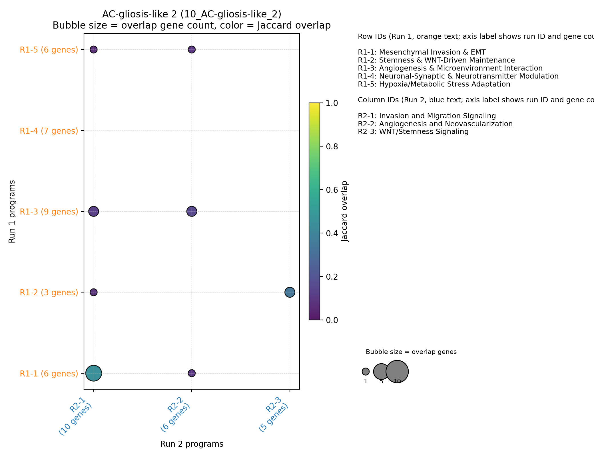
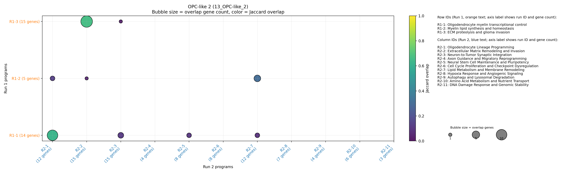

<!-- TODO: insert summary by editing reports/summary_intro.md -->

# DeepSearch Consistency and GO Coverage Report

## Run-to-run gene program consistency
DeepSearch run pairs are generally stable: the combined similarity metric (50 % gene-set Jaccard, 50 % name overlap) ranges from ~0.24 to ~0.54. Gliosis, Proliferative 2, and AC-gliosis-like 1 display the tightest reproducibility, while mixed OPC/NPC states fluctuate more, with higher fractions of unmatched programs. These results reinforce the need to treat program-level interpretations as probabilistic, especially in lineage-plastic contexts.

## GO enrichment coverage
All but one comparison file reports complete GO coverage: DeepSearch captured every GO term listed in the GSEA output, except for the Proliferative 2 model where 30 umbrella DNA-metabolism terms remained unmatched (76 % coverage). The gliosis-hypoxia and OPC-like 1 comparison markdowns still lack standardized tables, so those gene sets are excluded from the aggregate coverage stats.

## Methods
- Gene-program names from each DeepSearch run were embedded with `text-embedding-3-large`. A reference panel of unrelated biology phrases provided the baseline cosine distribution; all program–program cosines were mean-centered relative to that background to emphasize signal above random thematic similarity.
- For every run pair, similarities were computed between all program combinations. Gene-level overlap used the Jaccard index of their supporting gene sets, and name similarity used the rescaled cosine scores. The combined similarity equals the arithmetic mean of these two terms (50 % gene Jaccard + 50 % name cosine). Programs from the smaller run were linked to the highest-scoring partner that exceeded the matching threshold, producing one-to-one matches plus explicit unmatched lists.
- GO coverage statistics were derived by comparing each program’s DeepSearch annotation set with the manually curated GO tables supplied for the corresponding comparison. Coverage is reported as the fraction of GO entries that had at least one DeepSearch match; comparisons lacking tables were excluded. Visual summaries aggregate these metrics without additional weighting or smoothing.
## Methods
- Gene-program names from each DeepSearch run were embedded with `text-embedding-3-large`. A reference panel of unrelated biology phrases provided the baseline cosine distribution; all program–program cosines were mean-centered relative to that background to emphasize signal above random thematic similarity.
- For every run pair, similarities were computed between all program combinations. Gene-level overlap used the Jaccard index of their supporting gene sets, and name similarity used the rescaled cosine scores. The combined similarity equals the arithmetic mean of these two terms (50 % gene Jaccard + 50 % name cosine). Programs from the smaller run were linked to the highest-scoring partner that exceeded the matching threshold, producing one-to-one matches plus explicit unmatched lists.
- GO coverage statistics were derived by comparing each program’s DeepSearch annotation set with the manually curated GO tables supplied for the corresponding comparison. Coverage is reported as the fraction of GO entries that had at least one DeepSearch match; comparisons lacking tables were excluded. Visual summaries aggregate these metrics without additional weighting or smoothing. The underlying GO tables were generated with an LLM that groups related GO terms into coherent program summaries; individual grouped examples are included in each per-run report.

## Novel gene programs without GO counterparts
Ranked by the number of supporting genes (DeepSearch run 1).

| Annotation | Program | Supporting genes |
| --- | --- | --- |
| OPC-like 2 | Lipid Metabolism and Membrane Remodeling | 12 |
| NPC-neuronal-like 2 | Glioma Stem Cell Maintenance and Therapy Resistance | 8 |
| NPC-neuronal-like 1 | Transcriptional Regulation and Chromatin Remodeling | 7 |
| OPC-like 2 | Hypoxia Response and Angiogenic Signaling | 7 |
| AC-neuronal-like | Glioblastoma Immune Suppression | 6 |
| OPC-like 2 | Amino Acid Metabolism and Nutrient Transport | 6 |
| AC-gliosis-like 1 | Angiogenesis and Vascular Remodeling | 5 |
| NPC-neuronal-like 1 | GABAergic Neurotransmission | 5 |
| NPC-neuronal-like 1 | cAMP Signaling and Kinase Cascades | 4 |
| OPC-NPC-like | Sonic Hedgehog and GLI Signaling | 4 |

## Limitations and notes
- Comparison sets 9 (gliosis-hypoxia) and 12 (OPC-like 1) lack the required GO table, so they’re omitted from GO coverage metrics.
- Duplicate DeepSearch runs (identical program lists) are automatically detected and omitted from the similarity plot.
- The 50 / 50 similarity metric is heuristic: name changes between runs still rely on gene overlap to link programs.

## Duplicated runs
- NPC-neuronal-like 3 (12_NPC-neuronal-like_3): DeepSearch runs are identical; only run_1 is shown.
- OPC-AC-like 2 (14_OPC-AC-like_2): DeepSearch runs are identical; only run_1 is shown.

## 01_OPC-AC-like_1

| Smaller set | Matched set | Gene overlap | Gene Jaccard | Name sim | Combined |
| --- | --- | --- | --- | --- | --- |
| Mesenchymal invasion and matrix remodeling | Mesenchymal Invasion and ECM Remodeling | 6 | 0.67 | 0.72 | 0.70 |
| Immune evasion: MHC class I downregulation | Immune Evasion and Immune Microenvironment Interaction | 1 | 0.50 | 0.55 | 0.53 |
| Glial/astrocyte differentiation and tumor plasticity | Aberrant Neural and Synaptic Programs | 1 | 0.14 | 0.43 | 0.29 |
| Redox and ferroptosis resistance | Cancer Stemness, Plasticity, and Therapy Resistance | 2 | 0.33 | 0.24 | 0.29 |

**Component coverage:**
- OPC: Glial/astrocyte differentiation and tumor plasticity, Mesenchymal invasion and matrix remodeling, Aberrant Neural and Synaptic Programs, Proliferation and Aberrant Cell Cycle Regulation
- AC: Glial/astrocyte differentiation and tumor plasticity, Mesenchymal invasion and matrix remodeling, Aberrant Neural and Synaptic Programs, Proliferation and Aberrant Cell Cycle Regulation

Runs: [Run 1](01_OPC-AC-like_1/run_1.md) | [Run 2](01_OPC-AC-like_1/run_2.md)

## 03_NPC-neuronal-like_2

| Smaller set | Matched set | Gene overlap | Gene Jaccard | Name sim | Combined |
| --- | --- | --- | --- | --- | --- |
| Extracellular Matrix and Invasion | Extracellular Matrix Remodeling & Invasion | 4 | 0.50 | 0.79 | 0.65 |
| Glutamatergic Excitotoxicity and Synapse Dynamics | Glutamatergic & Synaptic Signaling Deregulation | 4 | 0.50 | 0.57 | 0.54 |
| Glioma Stem Cell Maintenance and Therapy Resistance | Transcriptional & Epigenetic Reprogramming | 4 | 0.33 | 0.34 | 0.34 |

**Component coverage:**
- NPC: Transcriptional & Epigenetic Reprogramming, Glutamatergic & Synaptic Signaling Deregulation, Glioma Stem Cell Maintenance and Therapy Resistance, Glutamatergic Excitotoxicity and Synapse Dynamics
- neuronal: Glutamatergic & Synaptic Signaling Deregulation, Axon Guidance & Cell Migration, Glioma Stem Cell Maintenance and Therapy Resistance, Glutamatergic Excitotoxicity and Synapse Dynamics

Runs: [Run 1](03_NPC-neuronal-like_2/run_1.md) | [Run 2](03_NPC-neuronal-like_2/run_2.md)

## 05_AC-neuronal-like

| Smaller set | Matched set | Gene overlap | Gene Jaccard | Name sim | Combined |
| --- | --- | --- | --- | --- | --- |
| Glioblastoma Stem Cell Maintenance & Therapy Resistance | Stemness & Plasticity Regulation | 2 | 0.33 | 0.66 | 0.50 |
| Glioblastoma Immune Suppression | Immune Evasion & TAM Polarization | 3 | 0.30 | 0.67 | 0.48 |
| Glioblastoma Invasion & Migration | Mesenchymal Invasion & EMT | 5 | 0.31 | 0.59 | 0.45 |
| Glioblastoma Angiogenesis & Hypoxic Adaptation | (no match) | - | - | - | - |

**Component coverage:**
- AC: Glioblastoma Angiogenesis & Hypoxic Adaptation, Glioblastoma Invasion & Migration, Stemness & Plasticity Regulation, Immune Evasion & TAM Polarization
- neuronal: Glioblastoma Invasion & Migration, Glioblastoma Stem Cell Maintenance & Therapy Resistance, Stemness & Plasticity Regulation, Calcium & Glutamate Signaling

Runs: [Run 1](05_AC-neuronal-like/run_1.md)

## 07_Proliferative

| Smaller set | Matched set | Gene overlap | Gene Jaccard | Name sim | Combined |
| --- | --- | --- | --- | --- | --- |
| Mitotic Cell Division Promotion | Spindle Assembly Checkpoint | 10 | 0.32 | 0.60 | 0.46 |
| Cell Cycle Progression and DNA Replication | DNA Replication and S-Phase Progression | 5 | 0.29 | 0.58 | 0.44 |
| Stemness and Tumorigenicity Drivers | Apoptosis Inhibition and Cell Survival | 2 | 0.25 | 0.18 | 0.22 |

**Component coverage:**
- Proliferative: Transcriptional Cell Cycle Regulation, Cell Cycle Checkpoint Control, Mitotic Cell Division Promotion, Cell Cycle Progression and DNA Replication

Runs: [Run 1](07_Proliferative/run_1.md)

## 09_Proliferative_2

| Smaller set | Matched set | Gene overlap | Gene Jaccard | Name sim | Combined |
| --- | --- | --- | --- | --- | --- |
| Chromatin Remodeling & Epigenetic Regulation | Epigenetic Regulation and Chromatin Remodeling | 6 | 0.67 | 0.79 | 0.73 |
| DNA Replication Licensing & Fork Progression | DNA Replication Licensing and Progression | 12 | 0.57 | 0.85 | 0.71 |
| DNA Damage Response & Repair (HR, FA, TLS) | Homologous Recombination and DNA Damage Response | 10 | 0.56 | 0.80 | 0.68 |
| Cell Cycle Regulation & Checkpoint Control | Cell Cycle Transcriptional Regulation | 4 | 0.29 | 0.51 | 0.40 |

**Component coverage:**
- Proliferative: Cell Cycle Regulation & Checkpoint Control, DNA Replication Licensing & Fork Progression, Cell Cycle Transcriptional Regulation, Mitotic Regulation and Chromosome Segregation

Runs: [Run 1](09_Proliferative_2/run_1.md)

## 10_AC-gliosis-like_2

| Smaller set | Matched set | Gene overlap | Gene Jaccard | Name sim | Combined |
| --- | --- | --- | --- | --- | --- |
| Invasion and Migration Signaling | Mesenchymal Invasion & EMT | 5 | 0.45 | 0.70 | 0.58 |
| WNT/Stemness Signaling | Stemness & WNT-Driven Maintenance | 2 | 0.33 | 0.62 | 0.48 |
| Angiogenesis and Neovascularization | Angiogenesis & Microenvironment Interaction | 2 | 0.15 | 0.59 | 0.37 |

**Component coverage:**
- AC: Neuronal-Synaptic & Neurotransmitter Modulation, Stemness & WNT-Driven Maintenance, Invasion and Migration Signaling, Angiogenesis and Neovascularization
- gliosis: Neuronal-Synaptic & Neurotransmitter Modulation, Hypoxia/Metabolic Stress Adaptation, Invasion and Migration Signaling, Angiogenesis and Neovascularization

Runs: [Run 1](10_AC-gliosis-like_2/run_1.md)

## 13_OPC-like_2

| Smaller set | Matched set | Gene overlap | Gene Jaccard | Name sim | Combined |
| --- | --- | --- | --- | --- | --- |
| Oligodendrocyte myelin transcriptional control | Oligodendrocyte Lineage Programming | 10 | 0.62 | 0.70 | 0.66 |
| ECM proteolysis and glioma invasion | Extracellular Matrix Remodeling and Invasion | 12 | 0.67 | 0.64 | 0.65 |
| Myelin lipid synthesis and homeostasis | Lipid Metabolism and Membrane Remodeling | 4 | 0.31 | 0.58 | 0.44 |

**Component coverage:**
- OPC: Oligodendrocyte myelin transcriptional control, ECM proteolysis and glioma invasion, Oligodendrocyte Lineage Programming, Neural Stem Cell Maintenance and Pluripotency

Runs: [Run 2](13_OPC-like_2/run_2.md)
