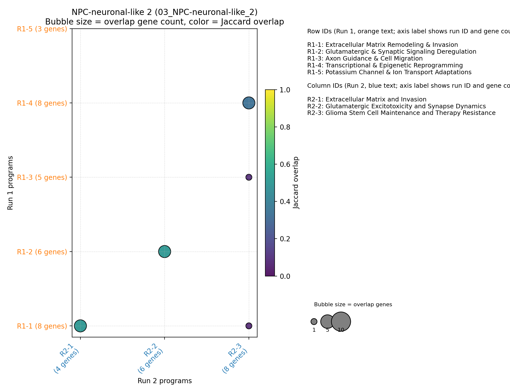
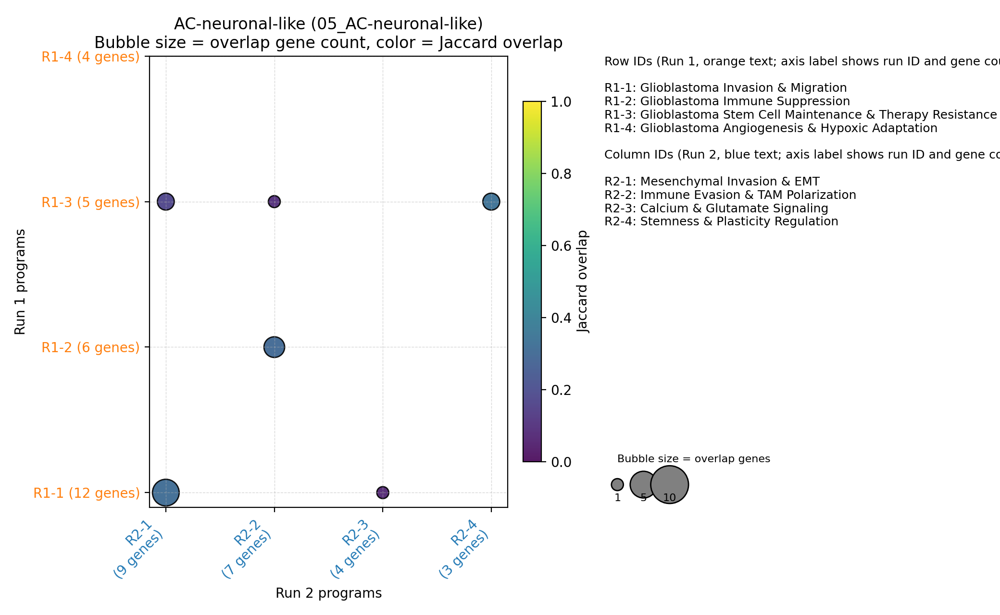
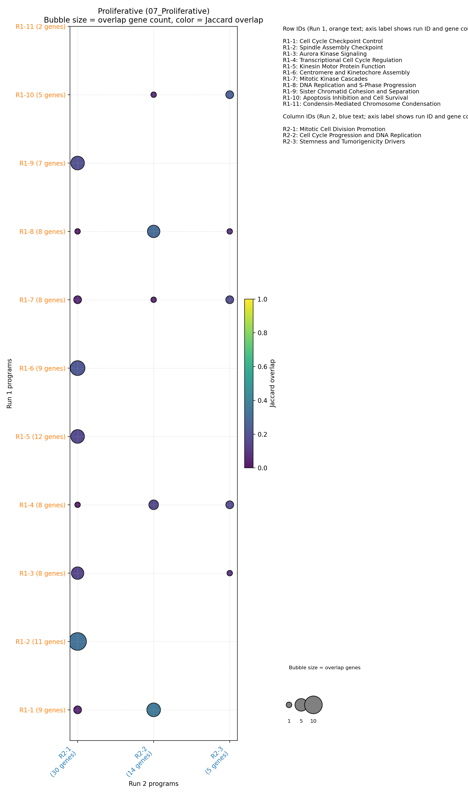
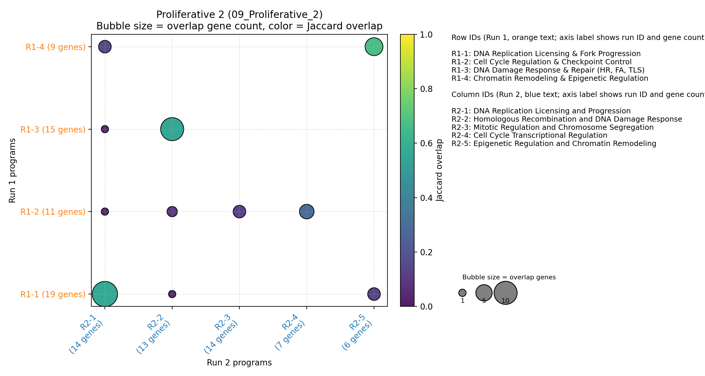
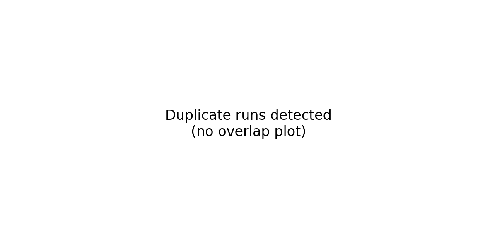

<!-- TODO: insert summary by editing reports/summary_intro.md -->

# DeepSearch Consistency and GO Coverage Report

## Run-to-run gene program consistency
DeepSearch run pairs are generally stable: the combined similarity metric (50 % gene-set Jaccard, 50 % name overlap) ranges from ~0.24 to ~0.54. Gliosis, Proliferative 2, and AC-gliosis-like 1 display the tightest reproducibility, while mixed OPC/NPC states fluctuate more, with higher fractions of unmatched programs. These results reinforce the need to treat program-level interpretations as probabilistic, especially in lineage-plastic contexts.

## GO enrichment coverage
All but one comparison file reports complete GO coverage: DeepSearch captured every GO term listed in the GSEA output, except for the Proliferative 2 model where 30 umbrella DNA-metabolism terms remained unmatched (76 % coverage). The gliosis-hypoxia and OPC-like 1 comparison markdowns still lack standardized tables, so those gene sets are excluded from the aggregate coverage stats.

## Methods
- Gene-program names from each DeepSearch run were embedded with `text-embedding-3-large`. A reference panel of unrelated biology phrases provided the baseline cosine distribution; all program–program cosines were mean-centered relative to that background to emphasize signal above random thematic similarity.
- For every run pair, similarities were computed between all program combinations. Gene-level overlap used the Jaccard index of their supporting gene sets, and name similarity used the rescaled cosine scores. The combined similarity equals the arithmetic mean of these two terms (50 % gene Jaccard + 50 % name cosine). Programs from the smaller run were linked to the highest-scoring partner that exceeded the matching threshold, producing one-to-one matches plus explicit unmatched lists.
- GO coverage statistics were derived by comparing each program’s DeepSearch annotation set with the manually curated GO tables supplied for the corresponding comparison. Coverage is reported as the fraction of GO entries that had at least one DeepSearch match; comparisons lacking tables were excluded. Visual summaries aggregate these metrics without additional weighting or smoothing.
## Methods
- Gene-program names from each DeepSearch run were embedded with `text-embedding-3-large`. A reference panel of unrelated biology phrases provided the baseline cosine distribution; all program–program cosines were mean-centered relative to that background to emphasize signal above random thematic similarity.
- For every run pair, similarities were computed between all program combinations. Gene-level overlap used the Jaccard index of their supporting gene sets, and name similarity used the rescaled cosine scores. The combined similarity equals the arithmetic mean of these two terms (50 % gene Jaccard + 50 % name cosine). Programs from the smaller run were linked to the highest-scoring partner that exceeded the matching threshold, producing one-to-one matches plus explicit unmatched lists.
- GO coverage statistics were derived by comparing each program’s DeepSearch annotation set with the manually curated GO tables supplied for the corresponding comparison. Coverage is reported as the fraction of GO entries that had at least one DeepSearch match; comparisons lacking tables were excluded. Visual summaries aggregate these metrics without additional weighting or smoothing. The underlying GO tables were generated with an LLM that groups related GO terms into coherent program summaries; individual grouped examples are included in each per-run report.

## Novel gene programs without GO counterparts
Ranked by the number of supporting genes (DeepSearch run 1).

| Annotation | Program | Supporting genes |
| --- | --- | --- |
| OPC-like 2 | Lipid Metabolism and Membrane Remodeling | 12 |
| NPC-neuronal-like 2 | Glioma Stem Cell Maintenance and Therapy Resistance | 8 |
| NPC-neuronal-like 1 | Transcriptional Regulation and Chromatin Remodeling | 7 |
| OPC-like 2 | Hypoxia Response and Angiogenic Signaling | 7 |
| AC-neuronal-like | Glioblastoma Immune Suppression | 6 |
| OPC-like 2 | Amino Acid Metabolism and Nutrient Transport | 6 |
| AC-gliosis-like 1 | Angiogenesis and Vascular Remodeling | 5 |
| NPC-neuronal-like 1 | GABAergic Neurotransmission | 5 |
| NPC-neuronal-like 1 | cAMP Signaling and Kinase Cascades | 4 |
| OPC-NPC-like | Sonic Hedgehog and GLI Signaling | 4 |

## Limitations and notes
- Comparison sets 9 (gliosis-hypoxia) and 12 (OPC-like 1) lack the required GO table, so they’re omitted from GO coverage metrics.
- Duplicate DeepSearch runs (identical program lists) are automatically detected and omitted from the similarity plot.
- The 50 / 50 similarity metric is heuristic: name changes between runs still rely on gene overlap to link programs.

## Duplicated runs
- NPC-neuronal-like 3 (12_NPC-neuronal-like_3): DeepSearch runs are identical; only run_1 is shown.
- OPC-AC-like 2 (14_OPC-AC-like_2): DeepSearch runs are identical; only run_1 is shown.

## 00_Gliosis

| Run 1 program | Run 2 program | Overlap genes | Gene Jaccard | Name overlap | Combined |
| --- | --- | --- | --- | --- | --- |
| Mesenchymal Transition & Invasion | Mesenchymal Transition & Invasion | 11 | 0.79 | 0.82 | 0.80 |
| Immunosuppression & Inflammation | Immune Modulation and Inflammation | 10 | 0.62 | 0.79 | 0.71 |
| Stem Cell Maintenance & Therapy Resistance | Stemness and Therapy Resistance | 3 | 0.38 | 0.80 | 0.59 |
| Hypoxia Response & Angiogenesis | Angiogenesis & Hypoxic Response | 5 | 0.45 | 0.71 | 0.58 |

## 01_OPC-AC-like_1

| Run 1 program | Run 2 program | Overlap genes | Gene Jaccard | Name overlap | Combined |
| --- | --- | --- | --- | --- | --- |
| Mesenchymal invasion and matrix remodeling | Mesenchymal Invasion and ECM Remodeling | 6 | 0.67 | 0.72 | 0.70 |
| Immune evasion: MHC class I downregulation | Immune Evasion and Immune Microenvironment Interaction | 1 | 0.50 | 0.55 | 0.53 |
| Glial/astrocyte differentiation and tumor plasticity | Aberrant Neural and Synaptic Programs | 1 | 0.14 | 0.43 | 0.29 |
| Redox and ferroptosis resistance | Cancer Stemness, Plasticity, and Therapy Resistance | 2 | 0.33 | 0.24 | 0.29 |

Reports: [Run 1](01_OPC-AC-like_1/run_1.md) | [Run 2](01_OPC-AC-like_1/run_2.md)

## 02_NPC-neuronal-like_1

| Run 1 program | Run 2 program | Overlap genes | Gene Jaccard | Name overlap | Combined |
| --- | --- | --- | --- | --- | --- |
| Extracellular Matrix Remodeling and Tumor Invasion | Extracellular Matrix Remodeling | 7 | 0.88 | 0.71 | 0.79 |
| Chromatin/Transcriptional Regulation and Tumor Suppressor Pathways | Transcriptional Regulation and Chromatin Remodeling | 6 | 0.75 | 0.64 | 0.70 |
| Motile Cilia Function and Structure | Motile Ciliary Axoneme | 16 | 0.70 | 0.67 | 0.68 |
| Neuronal and Synaptic Signaling Dysregulation | GABAergic Neurotransmission | 5 | 0.50 | 0.52 | 0.51 |
| Inflammatory and Mesenchymal Signaling | Neuregulin-BMP Signaling | 1 | 0.17 | 0.44 | 0.31 |

## 03_NPC-neuronal-like_2

| Run 1 program | Run 2 program | Overlap genes | Gene Jaccard | Name overlap | Combined |
| --- | --- | --- | --- | --- | --- |
| Extracellular Matrix and Invasion | Extracellular Matrix Remodeling & Invasion | 4 | 0.50 | 0.79 | 0.65 |
| Glutamatergic Excitotoxicity and Synapse Dynamics | Glutamatergic & Synaptic Signaling Deregulation | 4 | 0.50 | 0.57 | 0.54 |
| Glioma Stem Cell Maintenance and Therapy Resistance | Transcriptional & Epigenetic Reprogramming | 4 | 0.33 | 0.34 | 0.34 |

Reports: [Run 1](03_NPC-neuronal-like_2/run_1.md) | [Run 2](03_NPC-neuronal-like_2/run_2.md)

## 04_AC-gliosis-like_1

| Run 1 program | Run 2 program | Overlap genes | Gene Jaccard | Name overlap | Combined |
| --- | --- | --- | --- | --- | --- |
| Hypoxia/glycolytic metabolic adaptation | Metabolic Adaptation and Glycolysis | 1 | 1.00 | 0.65 | 0.82 |
| Aquaporin/ion channel invasion | Aquaporin/Ion Channel-Driven Migration | 3 | 0.60 | 0.73 | 0.67 |
| Mesenchymal transition and ECM remodeling | ECM Remodeling and Cell-Cell Adhesion | 7 | 0.64 | 0.67 | 0.65 |
| Angiogenesis and vascular niche formation | Angiogenesis and Vascular Remodeling | 4 | 0.57 | 0.63 | 0.60 |
| Immune/Inflammatory microenvironment regulation | Immunomodulation, Hypoxia, and Inflammation | 3 | 0.43 | 0.67 | 0.55 |
| Stem-like state and plasticity signaling | Reactive Astrocyte-Like State and Stemness | 2 | 0.20 | 0.48 | 0.34 |

## 05_AC-neuronal-like

| Run 1 program | Run 2 program | Overlap genes | Gene Jaccard | Name overlap | Combined |
| --- | --- | --- | --- | --- | --- |
| Glioblastoma Stem Cell Maintenance & Therapy Resistance | Stemness & Plasticity Regulation | 2 | 0.33 | 0.66 | 0.50 |
| Glioblastoma Immune Suppression | Immune Evasion & TAM Polarization | 3 | 0.30 | 0.67 | 0.48 |
| Glioblastoma Invasion & Migration | Mesenchymal Invasion & EMT | 5 | 0.31 | 0.59 | 0.45 |
| Glioblastoma Angiogenesis & Hypoxic Adaptation | (no match) | - | - | - | - |

Reports: [Run 1](05_AC-neuronal-like/run_1.md)

## 06_OPC-NPC-like

| Run 1 program | Run 2 program | Overlap genes | Gene Jaccard | Name overlap | Combined |
| --- | --- | --- | --- | --- | --- |
| RTK/RAS/PI3K Pathway Activation | EGFR/ERBB Family Signaling | 2 | 0.50 | 0.54 | 0.52 |
| Proneural-Mesenchymal Transition & Stem Cell Plasticity | Stemness and Dedifferentiation Program | 2 | 0.22 | 0.55 | 0.39 |
| Apoptosis and Therapy Resistance Programs | Immunosuppression | 1 | 0.20 | 0.36 | 0.28 |
| Neural and Axon Guidance, Migration | Mesenchymal Transition & Invasion | 1 | 0.08 | 0.23 | 0.15 |
| Aberrant Translation, Ribosome Biogenesis, and Metabolic Adaptation | (no match) | - | - | - | - |

## 07_Proliferative

| Run 1 program | Run 2 program | Overlap genes | Gene Jaccard | Name overlap | Combined |
| --- | --- | --- | --- | --- | --- |
| Mitotic Cell Division Promotion | Spindle Assembly Checkpoint | 10 | 0.32 | 0.60 | 0.46 |
| Cell Cycle Progression and DNA Replication | DNA Replication and S-Phase Progression | 5 | 0.29 | 0.58 | 0.44 |
| Stemness and Tumorigenicity Drivers | Apoptosis Inhibition and Cell Survival | 2 | 0.25 | 0.18 | 0.22 |

Reports: [Run 1](07_Proliferative/run_1.md)

## 08_Gliosis-hypoxia

| Run 1 program | Run 2 program | Overlap genes | Gene Jaccard | Name overlap | Combined |
| --- | --- | --- | --- | --- | --- |
| Mesenchymal Transition & Invasion | Mesenchymal transition & Invasion | 4 | 0.31 | 0.91 | 0.61 |
| Hypoxia Response & Survival | Hypoxia and metabolic reprogramming | 4 | 0.36 | 0.48 | 0.42 |
| EGFR-MET Oncogenic Signaling & Feedback | Growth factor & receptor tyrosine signaling | 2 | 0.22 | 0.56 | 0.39 |
| Angiogenesis & Vascular Niche | (no match) | - | - | - | - |

## 09_Proliferative_2

| Run 1 program | Run 2 program | Overlap genes | Gene Jaccard | Name overlap | Combined |
| --- | --- | --- | --- | --- | --- |
| Chromatin Remodeling & Epigenetic Regulation | Epigenetic Regulation and Chromatin Remodeling | 6 | 0.67 | 0.79 | 0.73 |
| DNA Replication Licensing & Fork Progression | DNA Replication Licensing and Progression | 12 | 0.57 | 0.85 | 0.71 |
| DNA Damage Response & Repair (HR, FA, TLS) | Homologous Recombination and DNA Damage Response | 10 | 0.56 | 0.80 | 0.68 |
| Cell Cycle Regulation & Checkpoint Control | Cell Cycle Transcriptional Regulation | 4 | 0.29 | 0.51 | 0.40 |

Reports: [Run 1](09_Proliferative_2/run_1.md)

## 10_AC-gliosis-like_2

| Run 1 program | Run 2 program | Overlap genes | Gene Jaccard | Name overlap | Combined |
| --- | --- | --- | --- | --- | --- |
| Invasion and Migration Signaling | Mesenchymal Invasion & EMT | 5 | 0.45 | 0.70 | 0.58 |
| WNT/Stemness Signaling | Stemness & WNT-Driven Maintenance | 2 | 0.33 | 0.62 | 0.48 |
| Angiogenesis and Neovascularization | Angiogenesis & Microenvironment Interaction | 2 | 0.15 | 0.59 | 0.37 |

Reports: [Run 1](10_AC-gliosis-like_2/run_1.md)

## 11_OPC-like_1

| Run 1 program | Run 2 program | Overlap genes | Gene Jaccard | Name overlap | Combined |
| --- | --- | --- | --- | --- | --- |
| Oligodendrocyte/Stem-like Myelination Program | Oligodendrocyte Differentiation & Myelin Formation | 6 | 0.55 | 0.66 | 0.60 |
| Calcium, Ion Channel, and Synaptic Pathway | Calcium Signaling & Ion Channel Activity | 6 | 0.38 | 0.55 | 0.46 |
| Cell Migration and Invasion | Extracellular Matrix & Basement Membrane Organization | 7 | 0.39 | 0.50 | 0.44 |
| Angiogenesis and Vascular Remodeling | Hypoxia Response & Angiogenic Signaling | 0 | 0.00 | 0.37 | 0.18 |

## 12_NPC-neuronal-like_3

_Duplicate run outputs; see run_1 report only._

Top matches: _skipped due to duplicate runs_

## 13_OPC-like_2

| Run 1 program | Run 2 program | Overlap genes | Gene Jaccard | Name overlap | Combined |
| --- | --- | --- | --- | --- | --- |
| Oligodendrocyte myelin transcriptional control | Oligodendrocyte Lineage Programming | 10 | 0.62 | 0.70 | 0.66 |
| ECM proteolysis and glioma invasion | Extracellular Matrix Remodeling and Invasion | 12 | 0.67 | 0.64 | 0.65 |
| Myelin lipid synthesis and homeostasis | Lipid Metabolism and Membrane Remodeling | 4 | 0.31 | 0.58 | 0.44 |

Reports: [Run 2](13_OPC-like_2/run_2.md)
